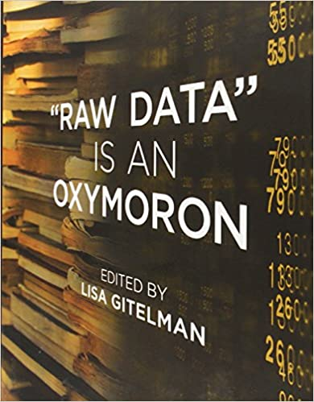
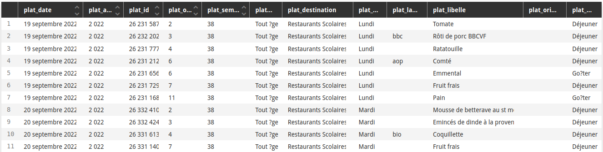

layout: true

---

background-image: url("https://media.giphy.com/media/xT9C25UNTwfZuk85WP/giphy-downsized-large.gif")
background-size: contains
class: inverse

## I. La donnée : qui est-elle ? Quels sont ses réseaux ?

---

background-image: url("https://media.giphy.com/media/d1E1kn94NNfrlPGw/giphy.gif")
background-size: contains
class: inverse, center

### Qu'est-ce que vous faîtes là ?

---

### Exercice : recensement par groupe

.quote[**Listez les données qui vous ont amené ici**]

*"Ici"* étant entendu comme **le Master DPAN de l'Unviersité de La Rochelle**, je vous demande de lister les données qui vont amènent à être présent·es aujourd'hui dans cette classe :

* leur nature ;
* leur provenance ;
* la façon dont vous les avez fourni.

.quote[Vous avez .red[10 minutes]].

---

background-image: url("https://media.giphy.com/media/Ot4U0KHw2fdvxJZ4jh/giphy-downsized-large.gif")
background-size: contains
class: inverse, center

### C'est parti !

---

### Recensement par groupe - résultats

.quote[Il est l'heure de restituer]

--

Constats :

* il y a différentes perceptions de la donnée ;
* il y a différentes perceptions de l'acte de fournir des données ;
* certaines données ne sont pas perçues comme telles.

---

background-image: url("https://media.giphy.com/media/gr1ayQmhUafWE/giphy.gif")
background-size: contains
class: inverse, center

class: inverse

### Sondage : qu'entendez-vous par "data" ?

---

### Combien de données pouvons-nous récolter dans cette pièce ?

--

.center[

]

Réponse : une infinité ! Car, par essence, **la donnée est .red[collectée].**

---

### La donnée est .red[fonctionnelle]

Une donnée n'est ni gratuite, ni immanente.

Produire de la donnée nécessite :
* des moyens
* des motivations
* une méthode.

Les données ne sont pas produites par hasard.

--

Il faut donc avoir une bonne raison de le faire.

---

### D'où vient l'heure officielle ?

--

.pull-left-wide[
Le *"Greenwich Mean Time"* (**GMT**) fut établit par le Royal Observatory de Greenwich (à Londres). Il fut dans un premier temps utilisé comme référence maritime (bien que celle-ci resta largement solaire).

Adopté par la Railway Clearing House en 1847 et par la plupart des compagnies de chemin de fer sous le nom de "*railway time"* ("heure ferroviaire"), il devint progressivement l'heure officielle au Royaume-Uni.

Il existe donc un phénomène de contamination, d'un besoin sectoriel vers un usage généralisé qui détermine une nouvelle norme.
]

.pull-right-narrow[
.reduite[

]
]

---

### La Bible : un best-seller plein de recensements

**Dans l'Ancien Testament**
* Le livre des Nombres comporte deux recensements ;
* David est puni pour avoir dénombré Israël et Juda ;

**Dans le Nouveau Testament**
* c'est à l'occasion du recensement de l'Empereur Auguste que Marie et Joseph quittent Nazareth pour se rendre à Bethléem.

--

Le contexte politique est incertain mais plusieurs auteurs romains attestent de ce projet :
Auguste souhaitait faire "un inventaire des ressources de son empire" : *"le nombre des citoyens et des alliés en armes, celui des flottes, des royaumes, des provinces"* (Tacite, Annales, 1,11)

---

### Lever les impôts et faire la guerre

.pull-left[
.quote[ *"combien et pourquoi"*, Vauban.]

En 1676, Vauban ordonne le recensement de Valenciennes : le premier recensement *"tête par tête"* de l'histoire de France.

Son objectif : *"actifs économiques et démographiques"*.

.footnote[Source : [Vauban, inventeur des recensements](https://www.persee.fr/doc/adh_0066-2062_1975_num_1975_1_1282), Vilquin, 1975]
]

.pull-right[
Recensement de la Nouvelle-France par Jean Talon (1666).

]

---

### Combien ça coûte un recensement ?

--

Le budget du recensement est fixé par la loi. En l'occurrence, [le décret du 17 décembre 2015](https://www.legifrance.gouv.fr/affichTexte.do?cidTexte=JORFTEXT000031632586&categorieLien=id) :
* 1.72€ par personne et 1.13€ par logement en "métropole" ;
* 2.05€ par personne et 1.36€ par logement dans les départements d'Outre-Mer, Saint-Pierre-et-Miquelon, Saint-Barthélemy et Saint-Martin.

Ces dernières années, le coût a totalisé environ 20 millions d'euros par an ([Sénat, 2017](https://www.senat.fr/questions/base/2017/qSEQ171202311.html)). Derrière cette production complexe se cachent de nombreuses tâches  :
* collecte
* compilation
* traitement
* publication.

--

Auxquelles s'ajoutent des contraintes administratives, légales et organistionnelles. C'est le **travail invisible de la donnée**, tel que décrit par Samuel Goëta ([Instaurer des données, instaurer des publics : une enquête sociologique dans les coulisses de l'open data](https://www.theses.fr/2016ENST0045), 2018).

---

### Comment l'Etat sait-il que vous existez ?

--

*.red[Le sachiez-tu ?]*
> *"Le fait, pour une personne ayant assisté à un accouchement, de ne pas faire la déclaration prescrite par l'article 56 du code civil dans les délais fixés par l'article 55 du même code est puni de six mois d'emprisonnement et de 3 750 euros d'amende."*

Source : [Article 433-18-1](https://www.legifrance.gouv.fr/affichCode.do?idSectionTA=LEGISCTA000006165376&cidTexte=LEGITEXT000006070719) du Code pénal.

--

Pareil pour l'université !

---

### La donnée est .red[produite]

Collectées dans une but, les données servent une ou plusieurs fonctions (politique, sociale, économique ...).

Elles doivent donc être adaptée aux méthodes et systèmes de traitement qui leur seront appliqués.

.pull-left[
.quote[*"Raw data is an oxymoron"*]
]

.pull-right[

]

---

### Standard : la mise en donnée du monde

La méthode de standardisation la plus courante est la **quantification**.

Si elle n'est pas la seule, cette méthode consistant à **"réduire les choses à des nombres"** apparaît comme le symbole d'un mouvement plus général : **.red[la mise en donnée du monde]**, parfois qualifiée de **dataification**.

.pull-left[
> Le verbe quantifier est employé ici dans un sens large : **exprimer et
faire exister sous une forme numérique ce qui, auparavant, était exprimé par
des mots et non par des nombres**.
]

.pull-right[

]

---

### Convention

.pull-left[
.reduite[
]
]

.pull-right[
En 1875, 17 nations signent la **[Convention du mètre](https://www.bipm.org/fr/metre-convention)**, traité international d'initiative française visant à instaurer un début d'uniformité dans les systèmes de poids et mesures.

Ce texte instaure un **Bureau international des poids et mesures** ([BIPM](https://www.bipm.org)) installé au Pavillon de Bréteuil, à Sèvres (Île-de-France). Il publie le Système International des unités (SI) et produit l'échelle de temps de référence (UTC).

On y trouve également le *"kilo de Sèvres"* qui servait de référence au kilogramme, unité de mesure de base, jusqu'à quelques décennies.
]

---

### La donnée se définit par .red[sa structure]

.quote[*"Une donnée, c'est ce qu'on met dans un jeu de données"*, Emmanuel Didier, sociologue de la quantification]

--

De quoi s'agit-il ?

--

Réponse : [le menu de la restauration scolaire](https://opendata.agglo-larochelle.fr/visualisation/table/?id=79f82500-13a3-45a8-8907-504112ee67f0) de la ville de La Rochelle.

---

### Une grille de lecture : les statistiques

Chaque élément d'un ensemble est appelé **observation**.

Pour **définir** un objet, nous avons besoin de critères qui proposent une dimension descriptive et permettent de les différencier : des éléments discriminants (dans le sens propre du terme), que nous nommerons des **variables**.

Nous renseignons chaque **variable** d'un terme, d'une quantité, d'une formule, d'un mot ... la forme même de ce mot est déterminante : c'est la **valeur** de la variable.

Le fait de consigner ces **valeurs** pour ces **variables** produit une collection qui sert de base à l'analyse.

Ces éléments enregistrés sur une personne, un événement, un lieu ou tout autre entité du monde réel, **ce sont des données**. Et leur collection **un jeu de données**.
---

### Les types de données

#### Selon vous, combien y a-t-il de types de données ?

--

En informatique, on distingue trois grandes catégories :
* les données numériques (avec lesquelles on peut calculer) ;
* les chaînes de caractères / strings ;
* les données booléennes (ou données binaires).

Vérifier si une condition est VRAI ou FAUSSE est la base de toute opération informatique. Le format binaire est le format de stockage informatique de base. Le *bit*, plus petite unité de stockage, ne peut contenir qu'une donnée des deux seuls types possibles :
* OFF - 0 - FALSE - NOT SET ;
* ON - 1 - TRUE - SET.

Le code American Standard Code for Information Interchange (ASCII) utilise 8 bits, soit 128 combinaisons, permettant de stocker tout l'alphabet latin et quelques signes de ponctuations et signaux (NUL, DEL, TAB, etc.).

---

### Exercice : grille de présentation

.quote[Listez par groupe les .red[8 données] qui vous paraissent pertinentes .red[pour vous présenter]
]

Les **données** sont ici entendues comme **atomiques**. Le prénom est une donnée, le nom en est une autre.

.quote[Vous avez .red[5 minutes]].

--

Ha ha, changement de consigne !

.center[

]

---

### Exercice : grille de présentation 2

.quote[Passez votre grille au groupe de gauche, récupérez celle du groupe de droite et complétez-la pour chaque membre de votre groupe.]

.quote[Quand tout le monde aura fini, nous procéderons à la restitution.]

--

Quelles différences d'approches avez-vous pu noter ?

--

**Le choix des variables modifie considérablement la représentation du monde par les données.**

---

background-image: url("https://media.giphy.com/media/3o6Mb3PGeR7EufOgYo/giphy.gif")
background-size: contains
class: inverse

## La prochaine fois ...

---

class: center, middle, inverse

### Merci pour votre attention !

#### *Contact : [Sylvain Lapoix](mailto:sylvain@datactivist.coop)*
