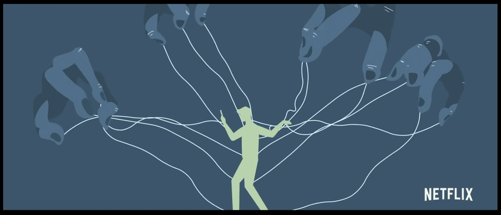
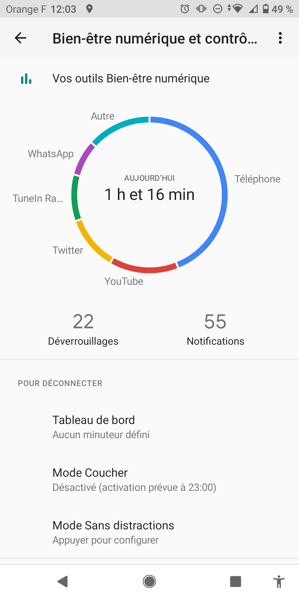
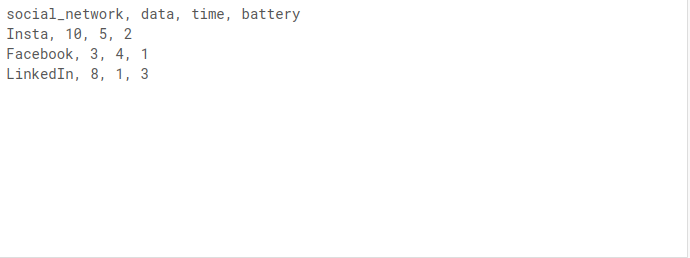
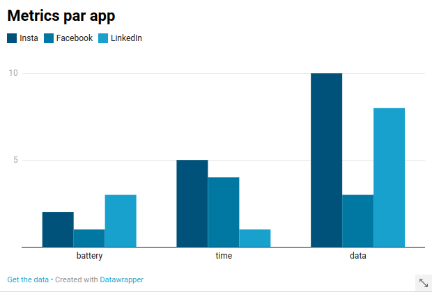
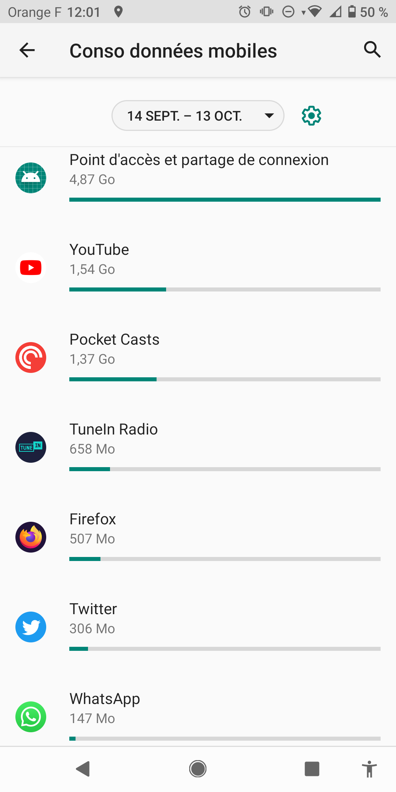
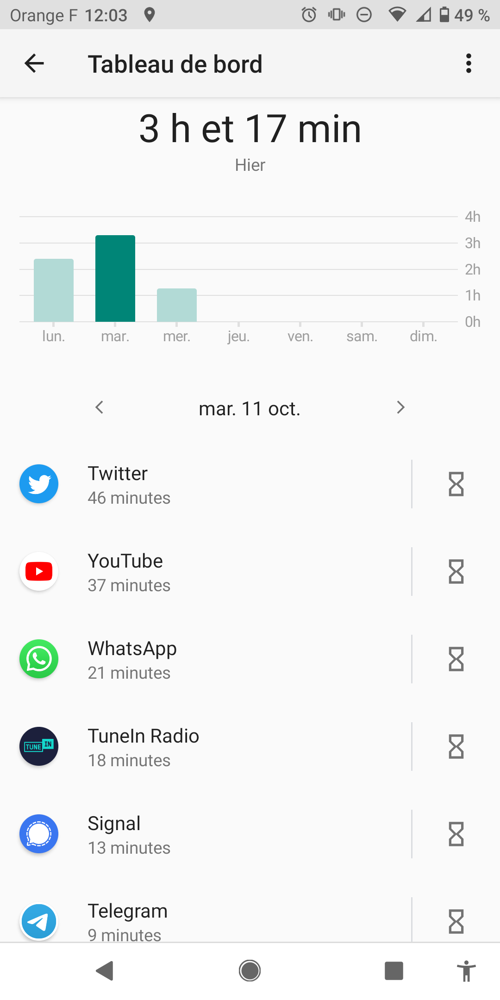
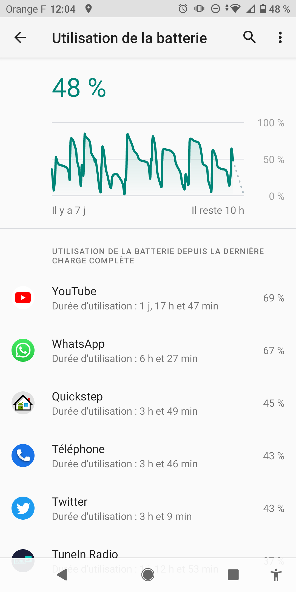
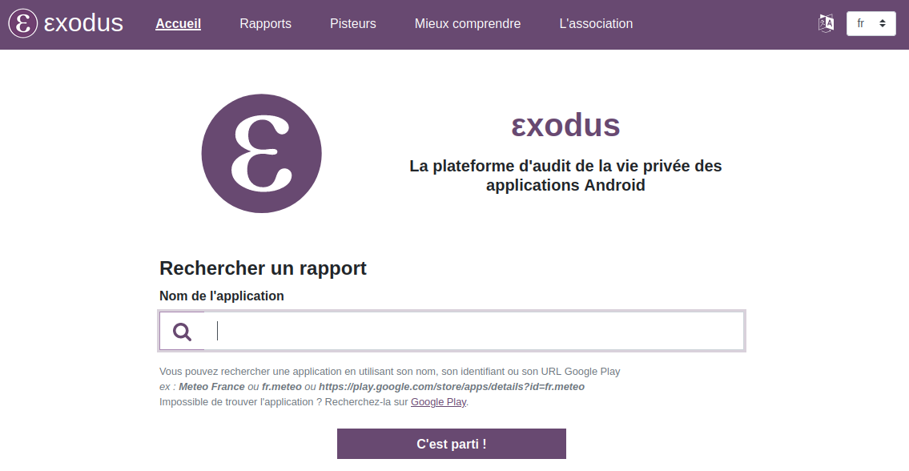
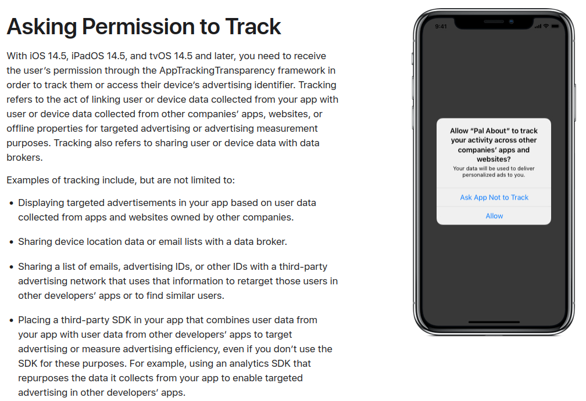
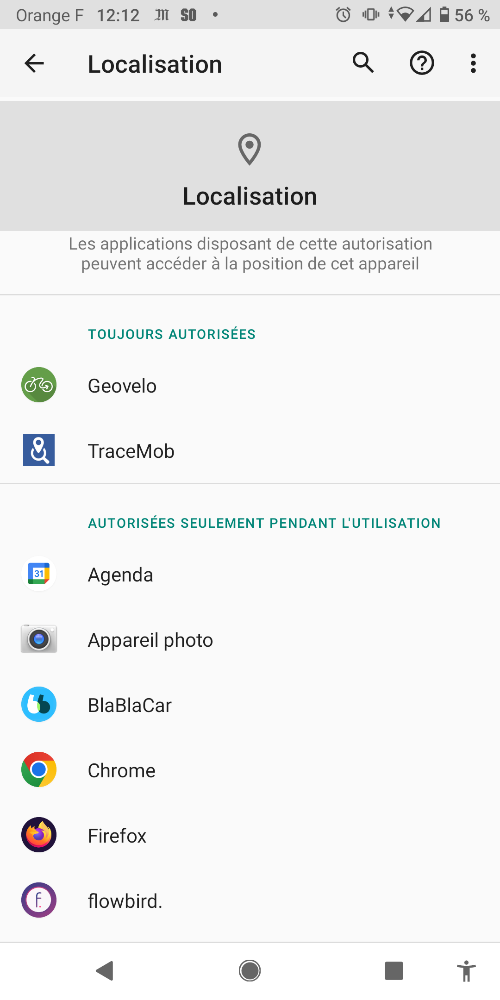

layout: true
  

`r paste0("
", params$event, " 

")` 

---

background-image: url("https://media.giphy.com/media/xT9C25UNTwfZuk85WP/giphy-downsized-large.gif")
background-size: contains
class: inverse

# I. Evaluation du périmètre

---

class: inverse

### Tentons de deviner

A votre avis : quelles sont, dans l'ordre, les trois apps de votre smartphone qui captent la plus grande quantité de données ?

.center[

]

--

.quote[
* Ecrivez votre classement sur un papier
* pliez-le et écrivez votre nom dessus
* remettez-le à Sylvain, alias "le prof"]

---

## Une tentative de rationnalisation

Deux façons de décrire les données captées par les apps :

.pull-left[**Quantitative**

Nous parlons ici de **la quantité de données transférées dans l'absolu**.

Tout fichier pouvant être ramené à une occupation mémoire, quel qu'en soit le type, nous pouvons tenter de mesurer la quantité de données collectées par ce biais.

Il implique cependant des biais fort (rapport poids entre image et texte, notamment).

]

.pull-right[**Qualitative**

Plusieurs types de données peuvent être récupérées par les apps :

* fichier issus du système (photos, contacts, SMS, mails ...) ;
* données issues des capteurs (GPS, accéléromètre ... ) ;
* données issues des périphériques médias (caméra et micro) ;
* etc.

]

---

background-image: url("https://media.giphy.com/media/5zoxhCaYbdVHoJkmpf/giphy.gif")
background-size: contains
class: inverse, center

## Partie 1 : quantitatif

---

background-image: url("https://media.giphy.com/media/IgSbum3io6QikjzSkd/giphy.gif")
background-size: contains
class: inverse, center

### Notre sésame : le "bien être"

---

class: inverse

### L'effet "Derrière nos écrans de fumée"

.center[

]

En 2020, le documentaire [Derrière nos écrans de fumée](https://www.youtube.com/watch?v=LrDXbCrSR68) (The social dilemma) relance le débat sur l'effet des applications, s'appuyant notamment sur le témoignage des "repentis de la tech".

---

### Parenthèse SHS : un traitement qui n'est pas sans angle mort

.center[

]

Ex. : Serge Tisseron, psychiatre, via [Urbania](https://www.youtube.com/watch?v=LrDXbCrSR68).

---

### Les interfaces "bien être" et gestion

.pull-left[
Tous vos smartphones disposent de diverses interfaces qui vous permettent d'accéder à des données d'usage de votre téléphone :

* usage de la batterie ;
* usage des données.

A cela s'ajoute les paramètres bien être qui donnent un renseignement complémentaire :

* temps d'usage.
]

.pull-right[
.center[

]
]

---

### Proposition de méthode

.pull-left[
**1. collecte de données d'usage**

]

.pull-right[
**2. visualisation**

.center[

]
]

---

### 1. Utilisation des données

.pull-left[

]

.pull-right[
* Source : interface gestion des réseaux ;
* Unité : mégaoctets ;
* Biais : peut se limiter aux seules données de réseau mobile, négligeant les données WiFi.
]

---

### 2. Temps d'utilisation

.pull-left[

]

.pull-right[
* Source : interface "bien être" ;
* Unité : heures / minutes ;
* Biais : le point de référence peut être différent (semaine complète, journée, etc).
]

---

### 3. Utilisation de la batterie

.pull-left[

]

.pull-right[
* Source : interface gestion de batterie ;
* Unité : variable (pourcentage, temps) ;
* Biais : indicateur peu standard, point de référence variable.
]

---

### Exercice : quantification comparative de la consommation de données

.quote[
1. réunissez dans un tableur les données sur le max d'app ;
2. formalisez-les dans [Datawrapper]() ;
3. analysez ces résultats.
]

Présentation dans 20 minutes.

---

background-image: url("https://media.giphy.com/media/S72QEV5YfVl4mRrakS/giphy.gif")
background-size: contains
class: inverse, center

## Partie 2 : qualitatif

---

### C'est quoi les trackers ?

La youtubeuse et développeuse Amy Plant s'est penchée sur la question et propose une synthèse pratique et didactique des enjeux techniques sous-jacents dans sa vidéo : [Je traque un téléphone (caméra, micro, localisation, galerie photo trackers : explications)](https://www.youtube.com/watch?v=qbGEvj_jkNY).

.center[

]

---

### Le travail d'Exodus Privacy

.center[

]

Jettons un oeil à [leur moteur de recherche](https://reports.exodus-privacy.eu.org/fr/) pour voir ...

---

### Plusieurs modes de collecte

Au delà des données fournies volontairement par les usager·ères via l'interface (**input**) et des données de fonctionnement (logs, credentials, etc.), les apps procèdent à deux types de collectes parallèles :

.pull-left[
**La collecte via des capteurs**

* caméra ;
* micro ;
* accéléromètre / gyroscope ;
* GPS ;
* NFC ;
* etc.

]

.pull-right[
**La collecte via d'autres applications**

* systèmes de fichier :
  * contacts ;
  * photos ;
  * numéros appelés ;
* contenus d'autres apps :
  * réseaux sociaux ;
  * gestionnaires (SMS, appel, etc.).

]

---

background-image: url("https://media.giphy.com/media/3o6ZtfPLtu0KZmBQxq/giphy.gif")
background-size: contains
class: inverse, center

### Vous allez rire : vous avez accès à ça aussi !

---

### "Permission to track"

Les politiques de respect de la vie privée des systèmes d'exploitation obligent désormais les apps à solliciter une *"permission to track"* (cf. [Apple dev](https://developer.apple.com/app-store/user-privacy-and-data-use/)), autrement dit, une autorisation à capter certaines données.

.center[

]

---

### La notion de "régime de partage"

.pull-left[

]

.pull-right[
Au delà de l'autorisation elle-même, les applications proposent différents *"régime de partage"*. Ces régimes déterminent les conditions dans lesquelles l'app peut récupérer les données d'une certaine source.

On en distingue quatre principaux :

* en permanence (arrière-plan) ;
* en usage ;
* à la demande ;
* jamais.

Mais le détail de à qui et pour quoi sont transférées les données n'est pas fourni.

]

---

### Exercice : cartographie des autorisations

.quote[

]

Présentation dans 20 minutes.

---

background-image: url("https://media.giphy.com/media/l0Hlx0M5OI1ogTGo0/giphy.gif")
background-size: contains
class: inverse

# II. Le cadre juridique

---

background-image: url("https://media.giphy.com/media/WS3kQlip00vwV8CXwQ/giphy.gif")
background-size: contains
class: inverse

## Connaissez-vous le RGPD ?

---

background-image: url("https://media.giphy.com/media/ZExxJPLQp1il0j115N/giphy.gif")
background-size: contains
class: inverse

## Et si nous lisions les conditions générales d'utilisation de vos données ?

---

### Exercice : tentative de lecture contextuelle des CGUs

.quote[
Suivant la liste d'applications sélectionnées :

1. listez les occurrences du mot "data" / "données" pour relever la phrase où le terme est utilisé et la partie des règles ;
2. proposez une traduction en français courant en documentant le contexte.
]

Rendez-vous dans 30 minutes !

---

background-image: url("")
background-size: contains
class: inverse

## Le RGPD

---

class: center, middle, inverse

### Merci pour votre attention !

#### *Contact : [Sylvain Lapoix](mailto:sylvain@datactivist.coop)*
